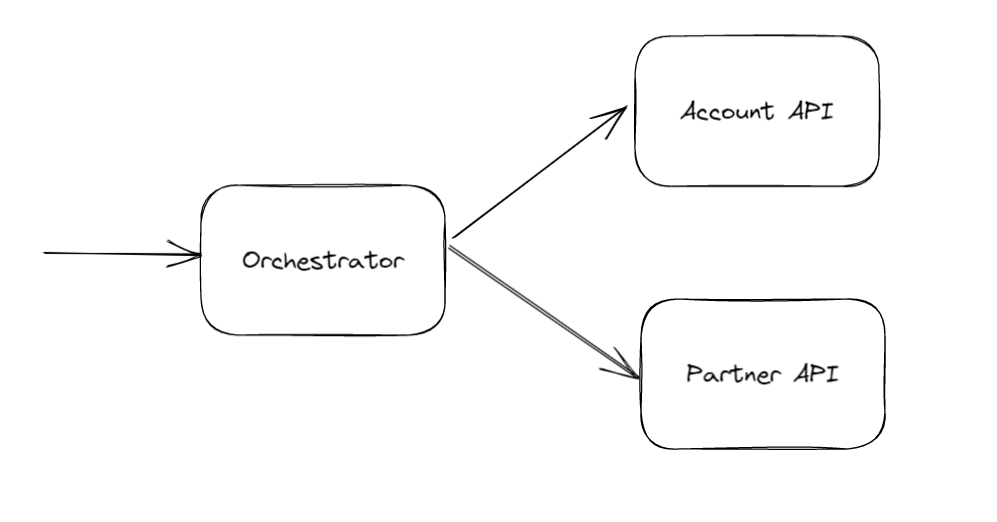

# About

This is an example project of transactional Saga using Mass transit. In this scenario, an order request is submitted to the Saga orchestrator. The orchestrator publishes message and the consumers will process the request, calling an (fake) api to debit account and an external (fake) api to confirm the order. In the end the Saga is finalized.



This project uses RabbitMQ as message bus and SQL Server as Saga repository.
To run RabbitMQ in Docker type the following in your console:

```
docker-compose up
```

It is configured to use SQL Server as LocalDB, but you can change it to whatever run mode you want.

# Test scenarios

- If you send an order Id that starts with "1" the result will be "Order completed" and finalize the Saga;
- Sending an order Id that starts with "2" the result will be a "Rollback" and finalize the Saga;
- Sending an order Id that starts with "E" the result will be a "Rollback error" and wait until it be solved;

# State machine


